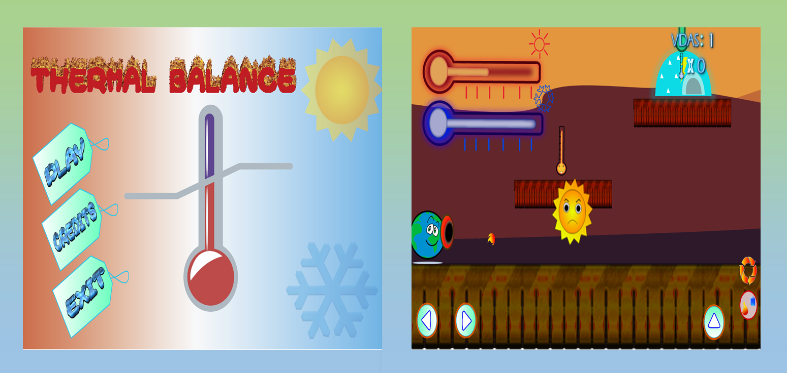

# **PORTFOLIO** 

 _Mavi Campos, 18 years_.

 _Brasilian, Potiguar_.

 _Developer Student - Graphic Student - Game Programming_.

#  **PRESENTATION** 
 

 I’m a potiguar digital game programming student through the IFRN-CM and I have 18 years old.

 I dream  i’ll be study languages in college with specialization in LIBRAS.

 I am currently a Portuguese Language monitor.

 I love the four movies:

1. Extraordinary 
2. The Hammer
3. The Age of Adaline
4. The Curious Case Of Benjamin Button

 My seven favorite books:

1. Eu, pescador de mim - Wagner Costa
2. O Príncipe - Nicolau Maquiavel
3. O futuro da Humanidade - Augusto Cury
4. Libras, que língua é essa? - Audrei Gesser
5. Meu primeiro beijo - Walcyr Carrasco
6. Crianças na Escuridão - Júlio Emílio Braz
7. Mudando de Casca - Giselda Laporta Nicolelis

# _CONTACTS_ 

 *E-mail:* <a href="https://outlook.live.com/mail/inbox" target="_blank"> vitoriafcampos@outlook.com.br </a>

 *Telefone:* _55(84) 98865-5596_

 *Curriculum lattes:* <a href="http://lattes.cnpq.br/7418730248694689" target="_blank"> Mavi Campos </a>

# _SOCIAL NETWORKS_ 

 *Instagram:* <a href="https://www.instagram.com/mavicamposs/?hl=pt-br" target="_blank"> @Mavicamposs </a>

 *Facebook:* <a href="https://www.facebook.com/vitoria.campos3154" target="_blank"> Mavi Campos </a>

 *Twitter:* <a href="https://www.twitter.com/MaviCamposss" target="_blank"> MaviCamposss </a>

 *Github:* <a href="https://github.com/MaviCampos" target="_blank"> MaviCampos </a>

# **GAMES** 

## AGAINST THE FLOW

 Until the love of your son would you?
Enter the adventure with Richard to save little Aurora!

<a href="https://mavicampos.github.io/ATF/" target="_blank"> Let's go! </a>

## ECOLOGICAL RELATIONSHIPS

 How many adventures have you had with your best friend?
How many adventures do you want to live with him again?
Zizi and Kika are best friends.
Help them have fun!

<a href="https://mavicampos.github.io/ERS/" target="_blank"> Let's go! </a>

## THERMAL BALANCE

 What are your limits?
The volume will increase or decrease your choice
Set a maximum temperature, or be careful not to cool. 
Good luck!

<a href="https://mavicampos.github.io/TB/" target="_blank"> Let's go! </a>

## SPIDER AIRCRAFT

 How about getting back to a classic?
Movies or game?
You decide!

<a href="https://mavicampos.github.io/SA/" target="_blank"> Let's go! </a>

## CITOGAME

 Difficulties with cytology?
Make your learning easier by phagocytizing in Guilherme's story!

<a href="https://mavicampos.github.io/SA/" target="_blank"> Let's go! </a>

# **ARTES** 

# **PROJETOS** 
## CLUBE DE ARGUMENTAÇÃO
 Desenvolvido em 2018 pela equipe de professores e tutores de Língua Portuguesa com o objetivo de aprimorar 
a argumentação e oralidade dos participantes. Consiste em encontros mensais com momentos de dinâmicas, teoria e prática. 
 *Instagram:* <a href="https://www.instagram.com/clubedeargumentacaoifrncm/?hl=pt-br" target="_blank"> @Clubedeargumentacaoifrncm </a>

# **PRÊMIOS** 
## SECITEX E MOCITEC

